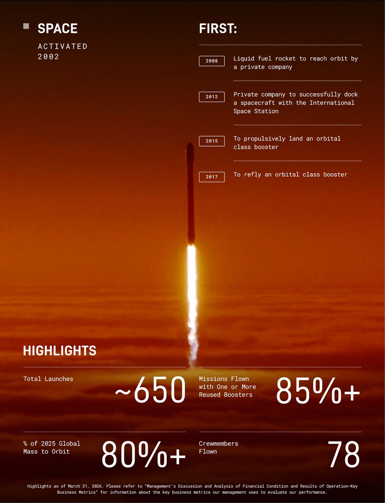
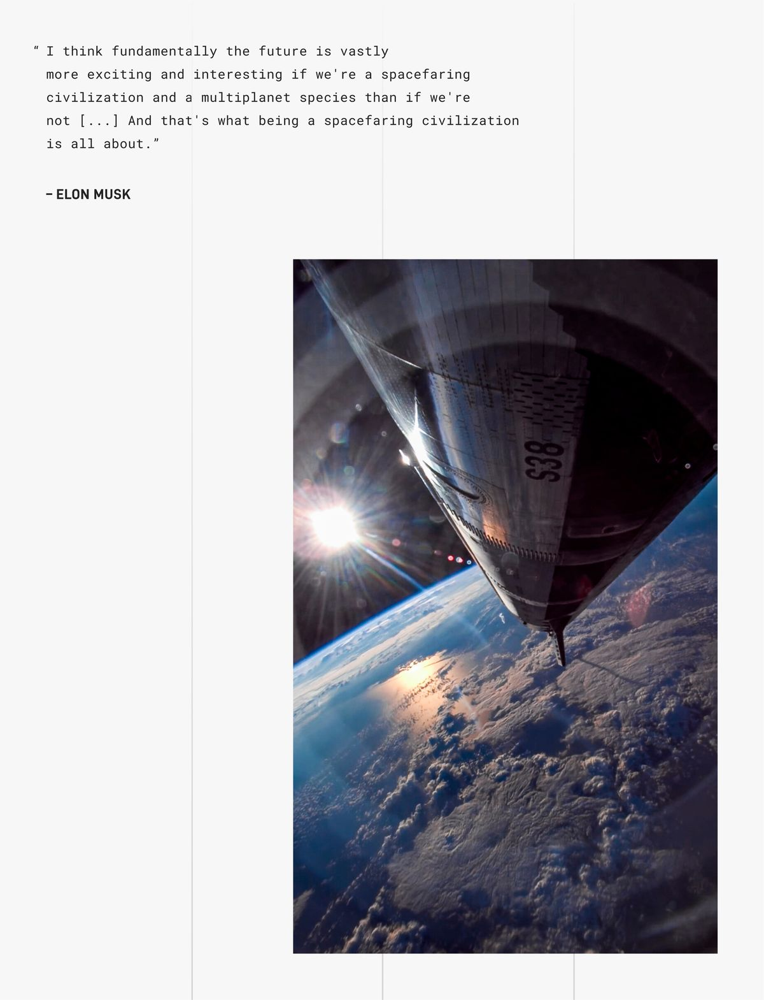
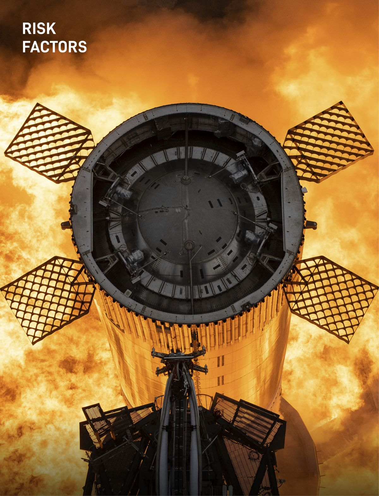

Normally, when a company files for an IPO, the document looks like a tax form. Times New Roman. Gray boxes. 280 pages of legalese designed to make your eyes glaze over before page 12.

SpaceX's S-1, [filed May 20, 2026](https://www.sec.gov/Archives/edgar/data/1181412/000162828026036936/spaceexplorationtechnologi.htm), is not that.

Within the first few pages is a full-bleed photograph of Mars. From there on, the document is sprinkled with **dozens more embedded images** — full-bleed launch photos, Elon pull-quote posters, glossy product spec sheets for every rocket in the fleet, and a "RISK FACTORS" section opener that is, no exaggeration, a photograph of a rocket on fire. (We'll get to that one.)

The whole thing reads more like a coffee-table magazine than an SEC filing. Which sets the tone — and signals the next several billion dollars they want from you. Let's walk through it.

## What Was Filed

The company is **Space Exploration Technologies Corp.**, headquartered at 1 Rocket Road, Starbase, Texas. (Yes, "Starbase" is now an actual incorporated town. No, I am not making that up.)

The ticker will be **SPCX**, dual-listed on Nasdaq and the brand-new Nasdaq Texas exchange — because when your CEO is in Texas, your rockets launch from Texas, and your headquarters is in Texas, you may as well list on the Texas exchange too. Goldman Sachs is the lead bank, with Morgan Stanley, BofA, Citi, JPMorgan, and Barclays just behind. Then seventeen more banks pile in underneath, presumably for moral support.

The price isn't in the document yet — they fill that in closer to the roadshow — but reporting around the filing puts it at roughly **$1.75 trillion** valuation, a **~$75 billion** raise, and a **June 12 listing**, with an indicative price of $525–530 per share ([TradingKey](https://www.tradingkey.com/analysis/stocks/us-stocks/261904604-spacex-ipo-spcx-date-set-for-june-12-175-trillion-valuation-tradingkey); [NBC News](https://www.nbcnews.com/tech/elon-musk/spacex-files-s-1-ipo-make-elon-musk-trillionaire-rcna346157)).

For reference: $1.75T puts SpaceX between Amazon and Alphabet in market cap on day one. The IPO alone would make Musk a trillionaire on paper. No pressure.

## The Company Is Now Three Businesses, Not One

The fact most people haven't fully absorbed yet: **SpaceX quietly absorbed xAI on February 2, 2026**, in what the lawyers call a "transaction between entities under common control." Translation: Musk owned both, so he merged them. The company you're buying into is no longer just a rocket company. It's a rocket company, an internet company, and an AI company, stapled together by the same controlling shareholder.

The three businesses make money in extremely different ways. One mints cash. One spends a fortune on the next rocket. One spends a fortune on, well, chips.

| Segment | Revenue | Op result | Capex |
| :--- | ---: | ---: | ---: |
| Space (Falcon, Dragon, Starship) | 4.1 | (0.7) | 3.8 |
| Connectivity (Starlink) | 11.4 | 4.4 | 4.2 |
| AI (xAI, Grok, X) | 3.2 | (6.4) | 12.7 |
| **Total** | **18.7** | **(2.6)** | **20.7** |

: All figures FY 2025, in USD billions.

Three quick takeaways:

- **Starlink is the engine.** Revenue grew **50%** year over year. Operating income grew **120%**. It's the only segment making real money, and it's making a *lot* of it.
- **Space looks like a loser, but it isn't really.** Starship development swallowed $3 billion of 2025 spend. Strip that out and the launch business — Falcon 9, Falcon Heavy, Dragon — is comfortably profitable. The headline loss is because Musk is building the next rocket.
- **AI is the hungry one.** $12.7 billion in capex in 2025, plus another $7.7 billion in Q1 2026 alone, against $3.2 billion of revenue. AI is the bet that lives downstream of Starlink's cash flow.

In one sentence: you are buying a satellite internet company that happens to own a rocket factory and a giant warehouse full of GPUs.

{width=60% fig-align="center"}

## Two Classes of Stock, One Person in Charge

The cap structure section is short, important, and a little spicy.

After the IPO, there will be two classes of stock:

- **Class A** — what you buy on the open market. One vote per share.
- **Class B** — held by Musk. **Ten votes per share.** And the kicker: Class B holders, voting as a class, elect a majority of the board on their own.

The S-1 spells it out plainly. Musk will **control the outcome of anything that requires a shareholder vote**, and SpaceX will use the "controlled company" exemption from a bunch of Nasdaq governance rules — including the one that usually requires a majority of independent directors on the board.

If you've followed Google, Meta, or Snap IPOs, you've seen this movie. Founder-controlled tech companies do it all the time. What's a little different here is that **Musk doesn't even need to win a Class A vote**. Class B alone elects a majority of the board. You're buying the cash flows. Musk keeps the steering wheel.

For passive investors, this matters in one specific way: index providers have been getting increasingly grumpy about super-voting structures, and the prospectus itself lists "exclusion from certain stock indices" as a risk factor. Even at $1.75 trillion, S&P 500 admission on day one is not guaranteed.

## The $1.25 Billion-a-Month Anthropic Contract

Now we get to the section that made me re-read the filing to make sure I wasn't hallucinating.

On May 3, 2026, SpaceX (using the data centers it inherited from xAI) signed a Cloud Services Agreement with **Anthropic** — the AI lab founded by former OpenAI researchers, makers of Claude. The terms:

> Pursuant to these agreements, the customer has agreed to pay us \$1.25 billion per month through May 2029.

That's **$15 billion a year**. For three years. From Anthropic. To Elon Musk's company.

Let's appreciate this for a second. Anthropic was founded by people who left OpenAI. OpenAI was co-founded by Elon Musk before he stormed out and started xAI. Now Anthropic is renting GPUs from Musk's xAI to train Claude, the model that competes most directly with ChatGPT.

It's the corporate equivalent of buying batteries from your ex.

The strategy actually makes sense for both sides, despite the optics:

- **Anthropic** has more money than it can spend on chips. They just raised $30B at a $380B valuation ([Forge](https://forgeglobal.com/insights/anthropic-upcoming-ipo-news/)). What they don't have is electricity. xAI's Memphis data centers came online in 122 days flat — a terrestrial speedrun — and have capacity to spare. Anthropic rents what they need.
- **xAI/SpaceX** gets to fund its own AI lab by selling compute to its biggest model competitor. This is exactly what OpenAI did to Microsoft in 2019. Except now SpaceX is playing the Microsoft role.

The optics are funny. The strategic logic is solid.

{width=50% fig-align="center"}

## The $60 Billion Option on Cursor

The Anthropic deal is the big one. The Cursor deal is the *weird* one.

In April 2026, SpaceX signed a "compute and option agreement" with **Cursor** — yes, that Cursor, the AI-powered code editor that every software engineer you know is currently using. The terms:

- SpaceX gives Cursor GPU capacity to run their product.
- SpaceX has the **option** to buy Cursor at an implied equity value of **$60 billion**, payable in SPCX stock.
- If SpaceX walks away, they owe Cursor **$10 billion** in pre-baked break-up fees ($1.5B option termination + $8.5B deferred compute services).

Why would a rocket company want to buy a code editor? The S-1 is fairly honest about it. Cursor's millions of developers generate "context-rich, verifiable data" about how humans actually write code — exactly the kind of training fuel that improves an AI model. You're not buying a code editor. You're buying a giant pipeline of human coding behavior, which happens to come wrapped inside a code editor.

This structure is genuinely new. It's the same compute-today-equity-tomorrow dance Microsoft did with OpenAI and Amazon did with Anthropic, but now applied one layer higher — at the *application* layer instead of the *model* layer. If it works, expect to see more of it. The next twelve months will probably involve a lot of AI startups being offered "free" compute that comes with a $40 billion option attached.

## OpenAI: The Two-Sentence Mention That Should Have Been Much Longer

The full S-1 mentions OpenAI exactly twice, both in routine "we have competitors" boilerplate. There is **no mention** of the lawsuit Musk filed in 2024 trying to block OpenAI's for-profit conversion and force out Sam Altman.

Why? Because two days before this S-1 was filed, a federal jury in California threw the lawsuit out.

The verdict landed on May 18, 2026. The jurors deliberated for **less than two hours** ([NPR](https://www.npr.org/2026/05/18/nx-s1-5822366/musk-altman-openai-jury-verdict-claims-dismissed); [Axios](https://www.axios.com/2026/05/18/musk-loses-ai-trial-openai-altman); [NBC News](https://www.nbcnews.com/tech/tech-news/openai-elon-musk-case-verdict-rcna345655)). They didn't even rule on the merits — they decided Musk had simply waited too long to sue. Statute of limitations. Game over. Musk's related claim against Microsoft was dismissed on the same grounds.

Musk's lawyer told reporters: *"This one is not over. I can sum it up in one word: appeal."* Sure.

But the timing is impossible to ignore. Filing a $75 billion IPO the same week your big-ticket lawsuit against your biggest AI rival gets dismissed in two hours is — let's say — *convenient*. The cloud that would have hung over SPCX's risk factors evaporated three trading days before the prospectus went public.

And in case you thought OpenAI was just going to sit there and watch Musk go public alone: on the same day this prospectus dropped, multiple outlets reported that **OpenAI is preparing to confidentially file its own S-1**, with the same lead banks (Goldman Sachs and Morgan Stanley), targeting a fall debut at a valuation that "exceeds $1 trillion" ([Bloomberg](https://www.bloomberg.com/news/articles/2026-05-20/openai-preparing-for-ipo-filing-in-days-or-weeks-wsj-reports); [Axios](https://www.axios.com/2026/05/20/openai-ipo-spacex-musk); [CNBC](https://www.cnbc.com/2026/05/20/openai-ipo-filing.html)).

So: in one week, Musk's lawsuit against OpenAI dies, SpaceX files publicly, and OpenAI files confidentially. None of that is *quite* planets-aligning, but it's close.

## Three Giants in Twelve Months

Three of the largest IPOs in the history of public markets are about to hit within roughly one calendar year:

| Company | Filing status | Target listing | Indicative size / valuation | Lead banks |
| :--- | :--- | :--- | :--- | :--- |
| SpaceX | S-1 public, May 20, 2026 | June 12, 2026 | ~$75B raise / ~$1.75T | Goldman, Morgan Stanley |
| OpenAI | Confidential S-1 imminent | Fall 2026 (~September) | >$1T valuation | Goldman, Morgan Stanley |
| Anthropic | Not filed; ~Q4 2026 expected | More likely 2027 | ~$60B+ raise / $380B+ | Not announced |

A few notes:

**The same two banks are running two of these deals.** Goldman Sachs and Morgan Stanley are leading both SpaceX and OpenAI. For deals this big and this competitively sensitive, that's unusual — normally the banks would split clients. The same teams will pitch Musk's company in June and Altman's company in September. The "Chinese walls" inside investment banks (the rules that supposedly stop one client's confidential info from leaking to another) are about to get a real-world stress test.

**The flow event is going to be loud.** SPCX at $1.75T would be a top-10 weight in any major US index that admits it. If OpenAI joins in the fall at $1T+, you'd have two of the five biggest companies in the world IPO'ing within five months. Every S&P 500 fund and Nasdaq-100 fund on Earth would need to buy a lot of stock, all on the same admission day. Quant desks have been modeling this for a quarter.

**Anthropic gets to wait.** They have $30B of run-rate revenue, just raised $30B, and have the cleanest equity story of the three — no founder-control questions, no rival lawsuits, no for-profit-conversion drama. Their stated plan is a 2027 listing. Filing third may turn out to be the best slot of the three.

## One More Thing: Possibly the First S-1 With Posters

Which brings us back to the cover.

A typical S-1 has exactly one image: the company logo, on page one. The ratio of text to pictures is roughly that of the IRS Form 1040 instructions.

SpaceX's S-1 has **dozens of embedded images**. Among them:

- A full-bleed photograph of Mars from orbit.
- Multiple full-page Musk pull-quotes set against glamour shots of Starship in flight.
- A "SPACE — ACTIVATED 2002 — FIRSTS" infographic with launch counts, reused-booster percentages, and crewmembers flown.
- A photograph of Starman (the spacesuit mannequin SpaceX launched on a Tesla Roadster in 2018, currently floating somewhere between Mars and the asteroid belt).
- Glossy spec sheets for Falcon 9, Falcon Heavy, Dragon, Starship, and Starlink V3.
- A **"RISK FACTORS"** section opener that is, literally, a photograph of a rocket surrounded by fire.

That last one is not metaphorical:

{width=55% fig-align="center"}

The page where the company discusses *what could go horribly wrong with the business* is, in the prospectus itself, illustrated by an image of their main product on fire.

Coinbase, Airbnb, and Roblox were the previous gold-standard for "S-1 with design sense" — branded color blocks, full-bleed photos, the occasional pull quote. None of them put a photograph of their core product on actual *fire* as the masthead of their risk factors. SpaceX may be the first.

There's a real argument that this is part of the offering. When you're trying to convince public-market investors to buy into a controlled company with an AI segment burning $12B a year and a CEO with a non-zero probability of any given Tuesday being interesting, "trust us, the vibes are great" is a legitimate strategy. The prospectus isn't selling a document. It's selling a feeling.

It's also, in fairness, the only S-1 you can read twice without falling asleep. That might be worth a few basis points all by itself.

---

*Financial figures and contract terms come from Space Exploration Technologies Corp.'s Form S-1, [filed with the SEC on May 20, 2026](https://www.sec.gov/Archives/edgar/data/1181412/000162828026036936/spaceexplorationtechnologi.htm). Images shown are downsampled reproductions of figures in the same filing. External reporting cited inline.*
