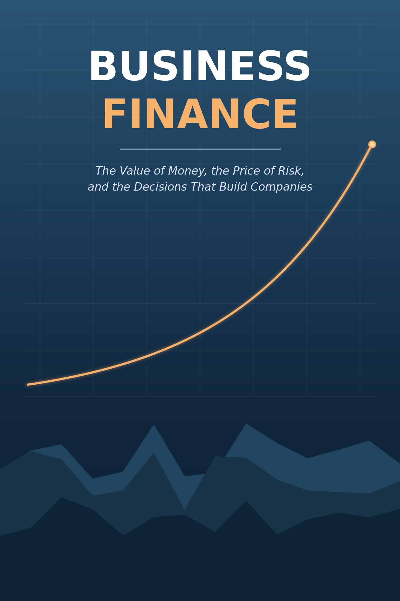

I'm writing two open, web-based textbooks for the undergraduate finance courses I teach. Both are works in progress, freely available online, and updated as the courses evolve.

## Business Finance

::: {.book-entry}
::: {.book-blurb}
<a href="https://imrenhe.github.io/fin3053-business-finance-book/" target="_blank" rel="noopener">**Read online →**</a>

An introduction to corporate finance for students with no prior finance background, written for FIN 3053. The book is organized around a single unifying idea — that the value of anything is the size, timing, and risk of the cash it will produce in the future — and follows a fictional company throughout to show how the pieces fit together. It covers financial statements, the time value of money, bond and stock valuation, capital budgeting, and risk and return. The approach emphasizes intuition over memorization, with worked examples shown three ways: by formula, by financial calculator, and in Excel.
:::

:::

## Investments

<a href="https://imrenhe.github.io/fin3133-investments-book/" target="_blank" rel="noopener">**Read online →**</a>

An undergraduate introduction to modern investment analysis, written for FIN 3133. The book covers asset types and how markets work, the risk–return relationship, portfolio construction, and valuation methods for both bonds and equities — building a foundation in the core principles and analytical techniques investors use.
