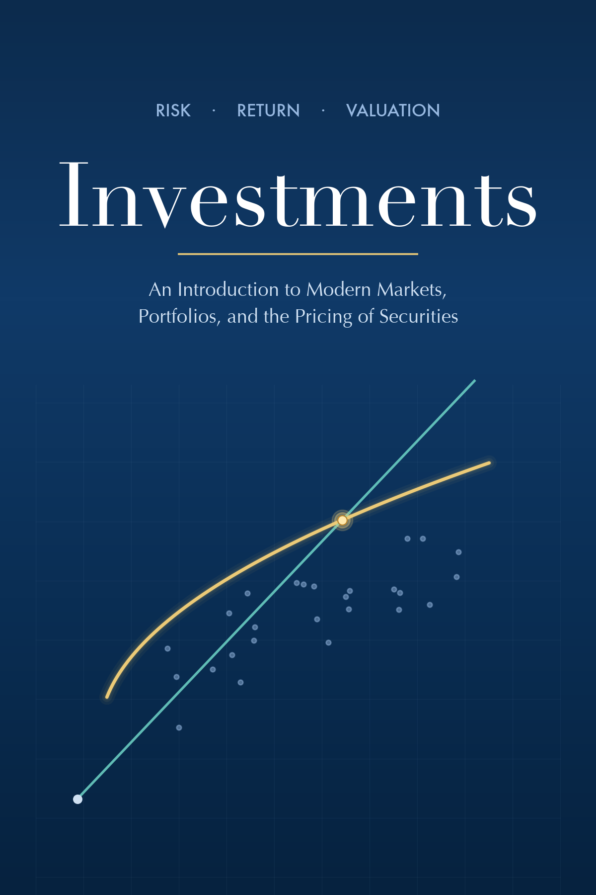

I'm writing two open, web-based textbooks for the undergraduate finance courses I teach. Both are works in progress, freely available online, and updated as the courses evolve.

## Business Finance

::: {.book-entry}
::: {.book-blurb}
<a href="https://imrenhe.github.io/fin3053-business-finance-book/" target="_blank" rel="noopener">**Read online →**</a>

An introduction to corporate finance for students with no prior finance background, written for FIN 3053. The book is organized around a single unifying idea — that the value of anything is the size, timing, and risk of the cash it will produce in the future — and follows a fictional company throughout to show how the pieces fit together. It covers financial statements, the time value of money, bond and stock valuation, capital budgeting, and risk and return. The approach emphasizes intuition over memorization, with worked examples shown three ways: by formula, by financial calculator, and in Excel.
:::

:::

## Investments

::: {.book-entry}
::: {.book-blurb}
<a href="https://imrenhe.github.io/fin3133-investments-book/" target="_blank" rel="noopener">**Read online →**</a>

An introduction to investing for students with no background in finance, written for FIN 3133. It builds from the ground up — what a stock, a bond, and a fund actually are — toward the tools professionals use to value securities, construct portfolios, and judge performance, always asking *why* a result holds rather than just how to compute it. A fictional firm, Cascade Devices, recurs throughout so each new idea builds on numbers you already recognize. Chapters move from asset classes, securities markets, and mutual funds, through the core theory of risk and return, diversification, the CAPM, and the efficient market hypothesis, to the application chapters on bond and stock valuation, financial statement analysis, and performance evaluation. Real-world examples, visual intuition, and copy-and-paste AI study prompts run through every chapter.
:::

:::
